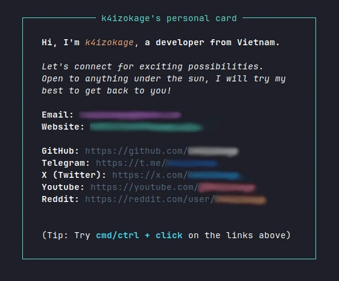

<div align="center">
<h3>My `cli card` to connect with me directly via console or terminal</h3>

[](https://badge.fury.io/js/k4izokage)

</div>

## 📦 How to use it?
1. Open your terminal.
2. Type this command and hit enter 👇.
```
npx k4izokage
```
3. You will see my personal card in your terminal.

## 📷 Screenshot
<div align="center">
    <p>⚠️ blurred the url for your own exploration</p>
    
</div>

## 📌 Credits
- [Salma Alam-Naylor's blog](https://whitep4nth3r.com/blog/build-a-business-card-cli-tool/)